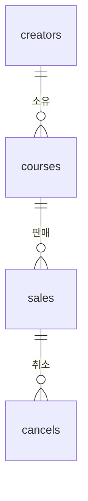
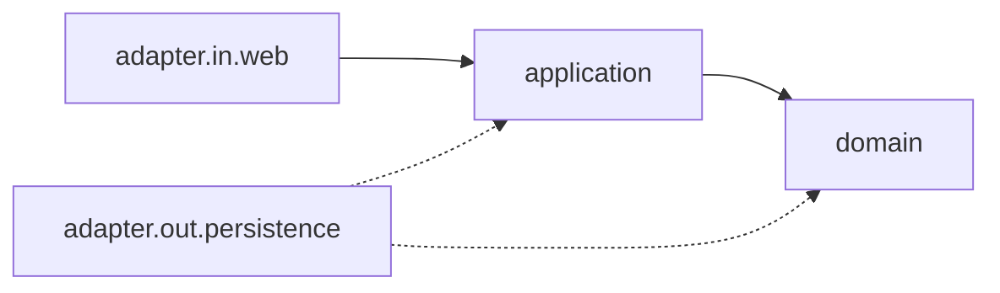

# 크리에이터 정산 API

## 목차

1. [프로젝트 개요](#프로젝트-개요)
2. [기술 스택](#기술-스택)
3. [실행 방법](#실행-방법)
4. [API 목록 및 예시](#api-목록-및-예시)
5. [데이터 모델 설명](#데이터-모델-설명)
6. [요구사항 해석 및 가정](#요구사항-해석-및-가정)
7. [설계 결정과 이유](#설계-결정과-이유)
8. [테스트 실행 방법](#테스트-실행-방법)
9. [미구현 / 제약사항](#미구현--제약사항)
10. [AI 활용 범위](#ai-활용-범위)

각 절은 요점만 담고, 상세는 [`docs/`](docs) 문서 6개로 링크합니다.

## 프로젝트 개요

온라인 강의 플랫폼의 크리에이터 정산 시스템입니다. 판매와 취소를 기록하고 기간별 정산 금액을 계산합니다.

수강생이 강의를 사면 크리에이터에게 돈이 가는데, 플랫폼이 순 판매액의 20%를 수수료로 뗍니다. 남는 금액이 **정산 예정 금액**입니다. 취소가 생기면 그만큼 순 판매액에서 빠집니다.

```text
  수강생 ──── 결제 ────▶ 강의 ────▶ 크리에이터
                          │  플랫폼이 순 판매액의 20% 수수료
                          ▼
                     정산 예정 금액
```

> ### 이것부터 알고 보셔야 합니다
>
> **운영자 기간 집계는 월별 정산의 합이 아닙니다.** creator-2 의 2025-01~03 을 운영자 API 로 조회하면 **48,000원**, 월별 API 세 번의 합은 **36,000원**입니다.
>
> 버그가 아닙니다. 두 API 가 서로 다른 구간으로 계산합니다. 운영자 집계는 기간 전체를 하나의 정산 구간으로 봅니다. 근거와 산식은 [운영자 기간집계 != 월별 정산 합](docs/01-정산-규칙과-KST-경계.md#운영자-기간집계--월별-정산-합), 이 동작을 잠그는 테스트는 [테스트 전략](docs/04-테스트-전략.md)에 있습니다.

## 기술 스택

| | |
| --- | --- |
| 언어·런타임 | Java 21 |
| 프레임워크 | Spring Boot 4.1.1 (Spring Framework 7) |
| 영속성 | Spring Data JPA · Hibernate |
| 데이터베이스 | H2 인메모리 |
| 빌드 | Gradle 9.7.1 (Wrapper 포함) |
| 테스트 | JUnit 5 · MockMvc · **112건** |
| 아키텍처 | 헥사고날 (포트와 어댑터) |

외부 의존이 없습니다. 네트워크 호출도, 메시지 브로커도, 별도 DB 설치도 필요하지 않습니다.

## 실행 방법

**Java 21** 만 있으면 됩니다. Gradle 은 Wrapper 가 들어 있습니다.

```bash
./gradlew bootRun     # http://localhost:8080
```

**H2 콘솔** — http://localhost:8080/h2-console · JDBC URL `jdbc:h2:mem:creator-settlement` · User `sa` · Password 없음. 인메모리라 재시작하면 초기 데이터로 돌아갑니다.

가장 빠른 확인입니다.

```bash
curl -s localhost:8080/api/creators/creator-1/settlements/2025-03 \
  -H 'X-Actor-Id: creator-1' -H 'X-Actor-Role: CREATOR'
```
```json
{
  "creatorId": "creator-1",
  "yearMonth": "2025-03",
  "grossSales": 260000,
  "saleCount": 4,
  "refunds": 110000,
  "cancelCount": 2,
  "netSales": 150000,
  "fee": 30000,
  "payout": 120000
}
```

## API 목록 및 예시

모든 요청에 `X-Actor-Id` 와 `X-Actor-Role`(`CREATOR` 또는 `ADMIN`) 헤더가 필요합니다.

| API | 메서드 | 경로 | 권한 |
| --- | --- | --- | --- |
| 판매 등록 | `POST` | `/api/sales` | ADMIN |
| 취소(환불) 등록 | `POST` | `/api/sales/{saleId}/cancellations` | ADMIN |
| 크리에이터 판매 목록 | `GET` | `/api/creators/{creatorId}/sales?from=&to=` | 본인 또는 ADMIN |
| 크리에이터 월별 정산 | `GET` | `/api/creators/{creatorId}/settlements/{yearMonth}` | 본인 또는 ADMIN |
| 운영자 기간 집계 | `GET` | `/api/admin/settlements?from=&to=` | ADMIN |

판매 등록 예시입니다.

```bash
curl -s -X POST localhost:8080/api/sales \
  -H 'Content-Type: application/json' \
  -H 'X-Actor-Id: admin-1' -H 'X-Actor-Role: ADMIN' \
  -d '{"courseId":"course-1","studentId":"student-9",
       "amount":50000,"paidAt":"2025-03-15T10:00:00+09:00"}'
```
```json
{
  "saleId": "7e0e5c4f-729a-44a7-80a7-8c9308cb8099",
  "courseId": "course-1",
  "studentId": "student-9",
  "amount": 50000,
  "paidAt": "2025-03-15T10:00:00+09:00"
}
```

**실패는 전부 RFC 9457 Problem Details 형식입니다.**

```json
{
  "type": "urn:problem-type:actor-access-denied",
  "title": "Forbidden",
  "status": 403,
  "detail": "creator creator-2 cannot access creator creator-1",
  "instance": "/api/creators/creator-1/settlements/2025-03",
  "code": "ACTOR_ACCESS_DENIED"
}
```

엔드포인트별 요청·응답 전체와 오류 코드 10종은 → **[00. API와 오류](docs/00-API-와-오류.md)**

## 데이터 모델 설명

테이블 4개입니다. 판매는 크리에이터를 직접 갖지 않고 **강의를 거쳐** 압니다.



| 테이블 | 담는 것 |
| --- | --- |
| `creators` | 크리에이터 3명 |
| `courses` | 강의 4개. 소유 크리에이터를 가리킵니다 |
| `sales` | 판매 7건. 강의, 수강생, 금액, 결제 시각 |
| `cancels` | 취소 3건. 원 판매를 가리키고 부분 취소가 가능합니다 |

**환불 상태 컬럼이 없습니다.** 취소 합계에서 매번 계산합니다. 저장하면 취소가 하나 더 들어올 때 갱신을 빠뜨립니다.

시간은 전부 `Instant`(UTC)로 저장하고 KST 해석은 `SettlementPeriod` 한 곳이 합니다.

ERD 전체, 인덱스 설계, 초기 데이터 17행, 조회 경로는 → **[02. 데이터 모델과 영속성](docs/02-데이터-모델과-영속성.md)**

## 요구사항 해석 및 가정

원본 과제와 다르게 판단한 것이 셋입니다.

**1. 기간 경계를 `말일 23:59:59` 대신 이상 미만으로 잡았습니다.** 그 표현은 `23:59:59.001` 부터 `23:59:59.999` 까지를 통째로 누락합니다. 밀리초 정밀도로 저장하는 시스템에서 그 사이에 결제가 들어오면 **어느 달에도 잡히지 않습니다.**

**2. 초과 환불 거부 규칙을 추가했습니다.** 원본에 없습니다. 누적 취소액이 원결제액을 넘으면 409 입니다. 판정은 `Sale` 애그리게이트가 소유해 어떤 경로도 우회할 수 없습니다.

**3. 취소 초기 데이터를 직접 정의했습니다.** 원본이 판매 데이터만 줬습니다. 금액과 귀속 월은 과제 서술("3월 취소", "2월 초 취소")에서 가져왔고 시각은 10:00 KST 로 고정했습니다.

그 외에 판매와 환불을 **서로 다른 기준 컬럼으로 집계**합니다. 판매는 `paidAt`, 환불은 `cancelledAt` 입니다. 1월에 팔고 2월에 취소하면 판매는 1월, 환불은 2월에 잡힙니다.

계산 규칙 전체와 KST 경계 처리는 → **[01. 정산 규칙과 KST 경계](docs/01-정산-규칙과-KST-경계.md)**

가정 전체와 근거는 → **[05. 미구현 범위](docs/05-미구현-범위.md)**

## 설계 결정과 이유

**헥사고날로 나눈 이유는 도메인을 프레임워크에서 떼어내기 위해서입니다.** `domain` 패키지에 Spring·JPA·Lombok import 가 **0건**이고, 그래서 계산 규칙 테스트 52건이 컨텍스트 기동 없이 돕니다.



**애그리게이트는 `Sale` 하나뿐입니다.** 누적 환불 ≤ 원결제를 지켜야 하는 지점이 프로젝트에서 여기 하나라서입니다. 불변식이 없는 정산 계산 쪽에는 두지 않았습니다.

**읽기와 쓰기가 다른 모델을 씁니다.** 목록 조회가 애그리게이트를 N개 적재하면 각각이 자기 취소를 딸고 와 N+1 이 됩니다. 읽기는 평면 데이터, 쓰기는 애그리게이트입니다.

**JPA 를 타입 있는 쿼리 실행기로만 씁니다.** 연관 매핑, 지연 로딩, 더티 체킹, 캐스케이드를 쓰지 않습니다. 쿼리는 JPQL 로 명시하고 조인 경로는 서브쿼리로 드러냅니다.

요청 흐름 5개와 계층별 책임은 → **[03. 아키텍처와 요청 흐름](docs/03-아키텍처와-요청-흐름.md)**

JPA 사용 방식과 설계 결정 목록은 → **[02. 데이터 모델과 영속성](docs/02-데이터-모델과-영속성.md#설계-결정)**

## 테스트 실행 방법

```bash
./gradlew test        # 112건
```

별도 준비가 필요 없습니다. H2 인메모리라 DB 설치도, 컨테이너도, 환경 변수도 없습니다.

| 계층 | 건수 |
| --- | ---: |
| `domain` (계산 규칙, 애그리게이트 불변식) | 52 |
| `adapter.in.web` (HTTP 계약, 오류 포맷, 인가) | 38 |
| `adapter.out.persistence` (조회 어댑터, 초기 데이터) | 11 |
| `application` (인가 판정, 집계 조합) | 7 |
| 기동·E2E·결정성 | 4 |

**절반 가까이가 Spring 없이 돕니다.** 같은 테스트를 두 번 연속 돌리면 같은 결과가 나오고, `now()` 호출이 0건이라 실행 시각에 의존하지 않습니다.

핵심 테스트 10건과 시나리오 대조표는 → **[04. 테스트 전략](docs/04-테스트-전략.md)**

## 미구현 / 제약사항

**보장하지 않는 것**

- **취소 동시성.** 같은 판매에 취소 두 건이 동시에 오면 각자 검사를 통과합니다. 실측으로 재현했습니다 — 80,000원 판매에 110,000원이 환불됩니다.
- **미래 시각.** `paidAt` 이 현재보다 뒤여도 받습니다.
- **마감된 달의 사후 변경.** ADMIN 이 임의의 `paidAt` 으로 과거 판매를 등록할 수 있습니다.
- **조회 기간 상한.** 10년 구간도 받고 페이지네이션도 없습니다.

**운영에 쓸 수 없는 설정**

- `ddl-auto=create-drop` 이라 기동할 때마다 스키마를 새로 만듭니다.
- H2 콘솔이 인증 없이 열려 있습니다. 채점 편의를 위한 설정입니다.

**액터 헤더는 실제 인증이 아닙니다.** `X-Actor-Role: ADMIN` 이라고 쓰면 그냥 운영자가 됩니다. 과제가 명시적으로 허용한 단순화입니다.

**만들지 않은 것** — 정산 확정 상태(PENDING → CONFIRMED → PAID), 중복 정산 방지, CSV 다운로드, 수수료율 변경 이력. 넷 다 과제의 선택 구현 항목이고, 각각 어디에 어떻게 붙는지는 문서에 설계로 남겼습니다.

제약 전체와 확장 경로는 → **[05. 미구현 범위](docs/05-미구현-범위.md)**

## AI 활용 범위

계획 → 명세 → 구현 → 검수를 Task 단위로 돌렸습니다. 산출물은 [`docs/process/`](docs/process)에 있습니다(계획 8건, 서브태스크 명세 45건). 읽지 않으셔도 시스템을 이해하는 데 지장이 없는 **과정 기록**입니다.

AI 는 코드 생성보다 **의사결정 보조와 검산**에서 값이 나왔습니다.

- **교차 검토로 잡은 것** — 쓰기 어댑터 부재(포트가 조회 4개뿐인데 등록 경로는 저장이 필요했습니다), 순환 의존(Task 4↔5), 헥사고날 방향 역전(유스케이스가 `adapter.in` 을 의존), Boot 4 의 테스트 애노테이션 모듈 분할.
- **실측으로 뒤집은 것** — 동시 취소 경합을 재현해 80,000원 판매에 110,000원이 환불되는 것을 확인했습니다. 흔히 제안되는 `@Version` 낙관적 락이 이 구조에서는 듣지 않는다는 것도 그 과정에서 드러났습니다.
- **사람이 판단한 것** — 운영자 집계를 단일 구간으로 할지 월별 합산으로 할지는 정책 판단이라 직접 정했습니다. 인덱스 컬럼 순서를 뒤집자는 제안은 두 조회 경로가 상반된 선행 컬럼을 원한다는 것이 드러나 철회했습니다.
- **AI 가 틀린 것** — 첫 계획에 순환 의존과 테스트 소유권 중복이 있었습니다. 문서를 각각 보면 완결돼 보였고 세트로 놓고 봐야 드러났습니다. 명세도 두 번 틀렸는데 둘 다 실제로 돌려 보고서야 알았습니다. **그럴듯한 문장과 사실을 가르는 것은 실행뿐입니다.**

이 README 의 JSON 과 수치는 전부 애플리케이션을 띄워 받은 실제 응답입니다.

---

## 문서

| | 답하는 질문 |
| --- | --- |
| [00. API와 오류](docs/00-API-와-오류.md) | 어떻게 부르고, 실패하면 무엇이 오는가 |
| [01. 정산 규칙과 KST 경계](docs/01-정산-규칙과-KST-경계.md) | **금액이 맞는가, 어느 달에 넣는가** |
| [02. 데이터 모델과 영속성](docs/02-데이터-모델과-영속성.md) | 데이터가 어떻게 생겼는가 |
| [03. 아키텍처와 요청 흐름](docs/03-아키텍처와-요청-흐름.md) | 코드가 어떻게 생겼고 어떻게 흐르는가 |
| [04. 테스트 전략](docs/04-테스트-전략.md) | 무엇으로 검증했는가 |
| [05. 미구현 범위](docs/05-미구현-범위.md) | 무엇을 하지 않았는가 |

시간이 없으시면 위 curl 을 돌려 보시고 **00 과 01** 만 읽으셔도 시스템을 이해하실 수 있습니다.
