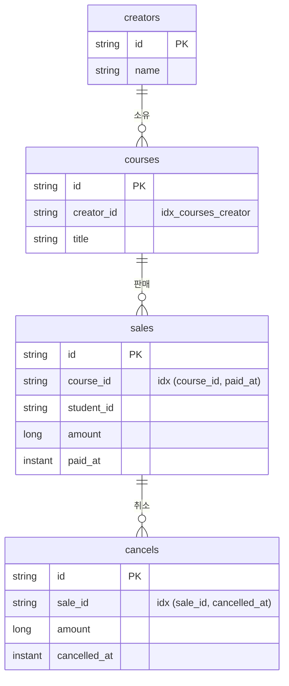

# 데이터 모델과 영속성

## 목차

1. [ERD](#erd)
2. [조회 경로](#조회-경로)
3. [초기 데이터 17행](#초기-데이터-17행)
4. [기대 정산](#기대-정산)
5. [JPA 사용방식](#jpa-사용방식)
6. [설계 결정](#설계-결정)
7. [하지 않은 것](#하지-않은-것)

## ERD

- **판매는 크리에이터를 직접 갖지 않습니다.** 강의를 거쳐 압니다. 비정규화하면 강의 소유자가 바뀔 때 판매 행 전부를 고쳐야 하고, 놓치면 과거 정산이 틀어집니다
- **환불 상태 컬럼이 없습니다.** 취소 합계에서 매번 계산합니다. 저장하면 취소가 하나 더 들어올 때 갱신을 빠뜨립니다

## 조회 경로

어느 조회가 어느 테이블을 거쳐 어느 시간 컬럼을 쓰는지입니다.

| 조회 | 경로 | 기간 필터 컬럼 |
| --- | --- | --- |
| 기간 내 판매 (정산·목록) | `sales → courses` | `paid_at` |
| 기간 내 취소 (정산) | `cancels → sales → courses` | `cancelled_at` |
| 판매별 전체 취소 (환불 상태) | `cancels` | **없음** |
| 크리에이터 전체 (실적 0 포함) | `creators` | 없음 |
| 강의 존재 확인 (등록 검증) | `courses` | 없음 |

**세 번째 행의 "없음"이 핵심입니다.** 환불 상태는 판매의 속성이지 기간의 속성이 아닙니다. 시간 조건을 넣으면 `sale-5`를 1월로 조회할 때 `FULL`이 아니라 `NONE`이 나옵니다.

위 두 행의 기준 컬럼이 서로 다른 것이 이중 집계 기준입니다.

## 초기 데이터 17행

크리에이터 3 + 강의 4 + 판매 7 + 취소 3입니다.

| 판매 | 강의 | 크리에이터 | 수강생 | 금액 | 결제 (KST) |
| --- | --- | --- | --- | ---: | --- |
| sale-1 | course-1 | creator-1 | student-1 | 50,000 | 2025-03-05 10:00 |
| sale-2 | course-1 | creator-1 | student-2 | 50,000 | 2025-03-15 14:30 |
| sale-3 | course-2 | creator-1 | student-3 | 80,000 | 2025-03-20 09:00 |
| sale-4 | course-2 | creator-1 | student-4 | 80,000 | 2025-03-22 11:00 |
| sale-5 | course-3 | creator-2 | student-5 | 60,000 | **2025-01-31 23:30** |
| sale-6 | course-3 | creator-2 | student-6 | 60,000 | 2025-03-10 16:00 |
| sale-7 | course-4 | creator-3 | student-7 | 120,000 | 2025-02-14 10:00 |

### 신규 추가데이터 (취소 데이터)
| 취소 | 원본 | 금액 | 취소 (KST) | 구분 |
| --- | --- | ---: | --- | --- |
| cancel-1 | sale-3 | 80,000 | 2025-03-25 10:00 | 전액 |
| cancel-2 | sale-4 | 30,000 | 2025-03-26 10:00 | 부분 |
| cancel-3 | sale-5 | 60,000 | **2025-02-03 10:00** | 전액, 월 경계 |

굵은 두 행이 월 경계 시나리오입니다. `sale-5`는 KST 1월 31일 23:30 결제(UTC `2025-01-31T14:30Z`), 취소는 2월입니다. **판매는 1월, 환불은 2월에 귀속됩니다.**

**취소 데이터는 원본 과제에 없어 직접 정의했습니다.** 금액과 귀속 월은 과제 서술("3월 취소", "2월 초 취소")에서 가져왔고, 시각은 10:00 KST로 고정했습니다. 자정에서 멀어 어떤 구간 구현에서도 흔들리지 않습니다.

## 기대 정산

| 크리에이터 | 월 | 총 판매(건) | 환불(건) | 순 판매 | 수수료 | 정산 예정 |
| --- | --- | --- | --- | ---: | ---: | ---: |
| creator-1 | 2025-03 | 260,000 (4) | 110,000 (2) | 150,000 | 30,000 | 120,000 |
| creator-2 | 2025-01 | 60,000 (1) | 0 (0) | 60,000 | 12,000 | 48,000 |
| creator-2 | 2025-02 | 0 (0) | 60,000 (1) | −60,000 | **0** | **−60,000** |
| creator-2 | 2025-03 | 60,000 (1) | 0 (0) | 60,000 | 12,000 | 48,000 |
| creator-3 | 2025-02 | 120,000 (1) | 0 (0) | 120,000 | 24,000 | 96,000 |
| creator-3 | 2025-03 | 0 (0) | 0 (0) | 0 | 0 | 0 |

**creator-2의 2025-02를 보십시오.** 판매 없이 1월 판매분의 취소만 있어 순 판매액이 음수입니다 — [수수료는 0에서 멈추고, 정산 예정액은 마이너스로 갑니다](01-정산-규칙과-KST-경계.md#수수료는-0에서-멈추고-정산-예정액은-마이너스로-갑니다).

## JPA 사용방식

**타입 있는 쿼리 실행기로만 씁니다.** 연관 매핑, 지연 로딩, 더티 체킹, 캐스케이드를 쓰지 않습니다. 쿼리는 JPQL로 명시하고 조인 경로는 서브쿼리로 드러냅니다.

| 기능 | 사용 |
| --- | --- |
| `@ManyToOne` · `@OneToMany` · `FetchType` · `Cascade` | 없음 |
| 더티 체킹으로 나가는 UPDATE | 없음 (취소 추가는 새 행 INSERT) |
| `@Transactional` | 유스케이스 5곳 (조회 3곳은 `readOnly`) |
| `.save()` | 쓰기 어댑터 4곳 |

**MyBatis를 쓰지 않은 이유.** 조회 4개, 저장 2개가 전부라 SQL을 따로 관리할 이득이 작았습니다. 갈아끼운다면 `adapter/out/persistence` 12개 파일만 바뀌고 도메인은 그대로입니다.

## 설계 결정

JPA에 미숙해 아래 내용들을 제외하고 설계를 하였습니다.

- `@ManyToOne` 미사용: N+1 이슈 회피, 필요한 조인은 JPQL 서브쿼리로 조회
- FK 제약 미사용: 애플리케이션이 `courseExists`로 걸러 404를 줍니다. FK에 맡기면 사용자 입력 오류가 500으로 새어 나갑니다
- setter 미생성: 금액이나 결제 시각이 사후에 바뀌면 이미 받은 정산액이 조용히 달라집니다
- `between` 미사용: 양끝이 닫혀 종료 경계가 포함됩니다. 이상 미만으로 직접 씁니다 (`paid_at >= :from and paid_at < :to`)
- 식별자 타입 래퍼 미사용: 원본 식별자가 `creator-1` 같은 문자열이라 래핑 이득보다 변환 코드가 큽니다
- Lombok을 도메인에 미사용: 값 타입은 `record`라 할 일이 없고, `Sale`에 `@Getter`를 붙이면 `cancels` 가변 리스트가 새어 불변식을 우회시킵니다
- `@Data`·`@EqualsAndHashCode` 미사용: equals/hashCode가 전체 필드 기반이 되어 JPA 식별자 의미론과 어긋나고 프록시에서 깨집니다
- `@ToString` 미사용: 연관을 걸면 지연 로딩을 건드립니다
- `@AllArgsConstructor` 미사용: 시그니처가 필드 선언 순서에 묶여, `String`이 인접한 생성자는 순서를 바꿔도 호출부가 컴파일됩니다

아래는 반대로 **선택한** 것들입니다.

- 시간은 `Instant`: `LocalDateTime`은 오프셋을 잃어 `sale-5`가 KST 1월인지 2월인지 값만 보고 판단할 수 없습니다. 변환 책임은 `SettlementPeriod` 하나에 격리했습니다
- 읽기·쓰기 모델 분리: 읽기(`SalesQueryPort`)는 `SaleData` 등 평면 데이터를, 쓰기(`SaleRepository`)는 `Sale` 애그리게이트를 다룹니다. 목록을 애그리게이트로 만들면 N개가 각자 취소를 딸고 오기 때문입니다
- 인덱스 컬럼 순서 유지: 두 조회 경로가 상반된 선행 컬럼을 원합니다. `findCancelsBySaleIds`는 시간 조건이 없어 `(cancelled_at, sale_id)`로 두면 풀스캔이 됩니다
- `ddl-auto=create-drop` + `data.sql`: 엔티티가 스키마의 단일 진실이 됩니다. `defer-datasource-initialization=true`가 없으면 테이블 없는 상태로 INSERT가 나가 기동이 실패합니다. 운영이라면 Flyway를 씁니다

## 하지 않은 것

- 마이그레이션 도구(Flyway·Liquibase)
- 낙관적·비관적 락 — [취소 동시성](05-미구현-범위.md#보장하지-않는-것) 참조
- 2차 캐시
- 페이징 — 판매 목록이 7건이라 필요가 없습니다
- 감사 필드(`createdAt` · `updatedAt`) — 정산 계산에 쓰이지 않습니다

---

관련 문서 — [정산 규칙과 KST 경계](01-정산-규칙과-KST-경계.md) · [아키텍처와 요청 흐름](03-아키텍처와-요청-흐름.md)
