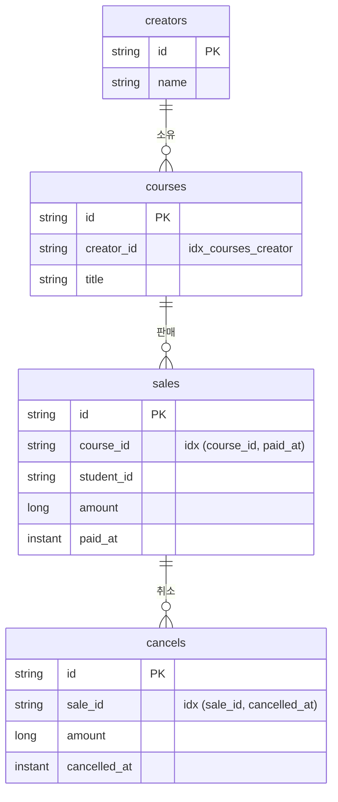

# 데이터 모델과 영속성

## 목차

1. [ERD](#erd)
2. [조회 경로](#조회-경로)
3. [초기 데이터 17행](#초기-데이터-17행)
4. [기대 정산](#기대-정산)
5. [JPA를 어떻게 쓰는가](#jpa를-어떻게-쓰는가)
6. [설계 결정](#설계-결정)
7. [하지 않은 것](#하지-않은-것)

## ERD



**판매는 크리에이터를 직접 갖지 않습니다.** 강의를 거쳐 압니다. 비정규화하면 조인이
사라지지만 강의 소유자가 바뀔 때 판매 행 전부를 같이 고쳐야 하고, 고치지 않으면 과거
정산이 조용히 틀어집니다. 7건 규모에서 조인 비용이 0이라 정규화를 택했습니다.

**환불 상태 컬럼이 없습니다.** 취소 합계에서 매번 계산합니다. 저장하면 취소가 하나 더
들어올 때 갱신을 빠뜨리는 경로가 생깁니다.

## 조회 경로

어느 조회가 어느 테이블을 거쳐 어느 시간 컬럼으로 좁히는지입니다.

| 조회 | 경로 | 기간 필터 컬럼 |
| --- | --- | --- |
| 기간 내 판매 (정산·목록) | `sales → courses` | `paid_at` |
| 기간 내 취소 (정산) | `cancels → sales → courses` | `cancelled_at` |
| 판매별 전체 취소 (환불 상태) | `cancels` | **없음** |
| 크리에이터 전체 (실적 0 포함) | `creators` | 없음 |
| 강의 존재 확인 (등록 검증) | `courses` | 없음 |

**세 번째 행의 "없음"이 핵심입니다.** 환불 상태는 기간의 속성이 아니라 판매의 속성이라
시간 조건을 걸지 않습니다. 조건을 넣으면 `sale-5`를 1월로 조회할 때 `FULL`이 아니라
`NONE`이 나옵니다.

위 두 행은 기준 컬럼이 서로 다릅니다. 이중 집계 기준이 쿼리 층에서 어떻게 생겼는지가
이 표입니다.

## 초기 데이터 17행

크리에이터 3 + 강의 4 + 판매 7 + 취소 3입니다.

| 판매 | 강의 | 크리에이터 | 수강생 | 금액 | 결제 (KST) |
| --- | --- | --- | --- | ---: | --- |
| sale-1 | course-1 | creator-1 | student-1 | 50,000 | 2025-03-05 10:00 |
| sale-2 | course-1 | creator-1 | student-2 | 50,000 | 2025-03-15 14:30 |
| sale-3 | course-2 | creator-1 | student-3 | 80,000 | 2025-03-20 09:00 |
| sale-4 | course-2 | creator-1 | student-4 | 80,000 | 2025-03-22 11:00 |
| sale-5 | course-3 | creator-2 | student-5 | 60,000 | **2025-01-31 23:30** |
| sale-6 | course-3 | creator-2 | student-6 | 60,000 | 2025-03-10 16:00 |
| sale-7 | course-4 | creator-3 | student-7 | 120,000 | 2025-02-14 10:00 |

| 취소 | 원본 | 금액 | 취소 (KST) | 구분 |
| --- | --- | ---: | --- | --- |
| cancel-1 | sale-3 | 80,000 | 2025-03-25 10:00 | 전액 |
| cancel-2 | sale-4 | 30,000 | 2025-03-26 10:00 | 부분 |
| cancel-3 | sale-5 | 60,000 | **2025-02-03 10:00** | 전액, 월 경계 |

굵은 두 행이 월 경계 시나리오입니다. `sale-5`는 KST 1월 마지막 날 23:30 결제(UTC로는
`2025-01-31T14:30Z`)이고 취소는 2월입니다. **판매는 1월, 환불은 2월에 귀속됩니다.**

**취소 초기 데이터는 원본 과제에 없어 직접 정의했습니다.** 금액과 귀속 월은 과제
서술("3월 취소", "2월 초 취소")에서 가져오고, 구체 시각은 10:00 KST로 고정했습니다.
자정에서 멀어 어떤 구간 구현에서도 귀속 월이 흔들리지 않습니다.

## 기대 정산

| 크리에이터 | 월 | 총 판매(건) | 환불(건) | 순 판매 | 수수료 | 정산 예정 |
| --- | --- | --- | --- | ---: | ---: | ---: |
| creator-1 | 2025-03 | 260,000 (4) | 110,000 (2) | 150,000 | 30,000 | 120,000 |
| creator-2 | 2025-01 | 60,000 (1) | 0 (0) | 60,000 | 12,000 | 48,000 |
| creator-2 | 2025-02 | 0 (0) | 60,000 (1) | −60,000 | **0** | **−60,000** |
| creator-2 | 2025-03 | 60,000 (1) | 0 (0) | 60,000 | 12,000 | 48,000 |
| creator-3 | 2025-02 | 120,000 (1) | 0 (0) | 120,000 | 24,000 | 96,000 |
| creator-3 | 2025-03 | 0 (0) | 0 (0) | 0 | 0 | 0 |

**creator-2의 2025-02가 가장 설명이 필요한 행입니다.** 판매 없이 1월 판매분의 취소만 있어
순 판매액이 음수입니다. 근거는
[수수료와 정산 예정액은 다른 종류의 수입니다](01-정산-규칙과-KST-경계.md#수수료와-정산-예정액은-다른-종류의-수입니다).

## JPA를 어떻게 쓰는가

**타입 있는 쿼리 실행기로만 씁니다.** 연관 매핑, 지연 로딩, 더티 체킹, 캐스케이드를 쓰지
않습니다. 쿼리는 JPQL로 명시하고 조인 경로는 서브쿼리로 드러냅니다.

| 기능 | 사용 |
| --- | --- |
| `@ManyToOne` · `@OneToMany` · `FetchType` · `Cascade` | 없음 |
| 더티 체킹으로 나가는 UPDATE | 없음 (취소 추가는 새 행 INSERT) |
| `@Transactional` | 유스케이스 5곳 (조회 3곳은 `readOnly`) |
| `.save()` | 쓰기 어댑터 4곳 |

**MyBatis를 쓰지 않은 이유.** 조회 4개, 저장 2개가 전부라 SQL을 따로 관리할 이득이
작았습니다. 헥사고날이라 갈아끼우는 범위가 `adapter/out/persistence` 9개 파일로 한정되므로,
필요해지면 도메인을 건드리지 않고 바꿀 수 있습니다.

## 설계 결정

**연관 매핑을 걸지 않았습니다.** `@ManyToOne`을 걸면 지연 로딩 프록시와 N+1이 따라옵니다.
더 나쁜 것은 어댑터가 어떤 쿼리를 던지는지 코드만 봐서는 알 수 없게 된다는 점입니다.
필요한 조인은 JPQL 서브쿼리로 명시합니다.

```java
where s.courseId in (select c.id from CourseEntity c where c.creatorId = :creatorId)
```

이 프로젝트에는 N+1이 발생할 지점이 없습니다. 판매 목록의 환불 상태도 `findBySaleIdIn`으로
한 번에 가져와 2쿼리로 끝냅니다.

**FK 제약을 걸지 않았습니다.** 없는 `courseId`로 판매를 등록하는 요청은 애플리케이션이
`courseExists`로 걸러 `CourseNotFoundException` 404를 줍니다. FK에 맡기면
`DataIntegrityViolationException`이 500으로 새어 나가, 사용자 입력 오류를 서버 오류로
보고하게 됩니다.

**setter를 만들지 않았습니다.** 판매 금액이나 결제 시각이 사후에 바뀌면 이미 조회된 정산이
조용히 달라집니다. 3월 정산으로 120,000원을 받았는데 나중에 같은 달이 다른 값이 되는 것은
정산 API에서 버그입니다.

**시간은 `Instant`입니다.** `LocalDateTime`은 오프셋을 잃습니다. `sale-5`가 KST 1월인지
2월인지 값만 보고 판단할 수 없게 됩니다. 시간대 변환 책임은 `SettlementPeriod` 하나에
격리했습니다.

**반열린 구간을 쿼리에 직접 씁니다.** `between`은 양끝이 닫혀 종료 경계가 포함되므로 쓰지
않습니다. 도메인이 경계 테스트 3방향으로 잠근 판단을 어댑터에서 무너뜨리면 안 됩니다.

```sql
paid_at >= :fromInclusive and paid_at < :toExclusive
```

**인덱스 컬럼 순서를 뒤집지 않았습니다.** 두 조회 경로가 상반된 선행 컬럼을 원합니다.

| 조회 | 원하는 선행 컬럼 |
| --- | --- |
| 크리에이터별 판매 | `course_id` |
| 기간별 전체 판매 | `paid_at` |
| `findCancelsBySaleIds` | `sale_id` (**시간 조건이 없음**) |

`(cancelled_at, sale_id)`로 두면 시간 조건 없는 조회가 선행 컬럼을 못 써 풀스캔이 됩니다.
7건 규모에서 실측 차이가 0이라 현행을 유지하고 관찰만 남깁니다.

**읽기 모델과 쓰기 모델을 나눴습니다.**

| 방향 | 인터페이스 | 위치 | 돌려주는 것 |
| --- | --- | --- | --- |
| 읽기 | `SalesQueryPort` | `application/port/out` | `SaleData` · `CancelData` · `SaleRecord` |
| 쓰기 | `SaleRepository` | `domain/sales` | `Sale` 애그리게이트 |

읽기가 애그리게이트를 쓰지 않는 이유는 N+1입니다. 목록을 만들려고 애그리게이트를 N개
로딩하면 각각이 자기 취소를 딸고 옵니다. 쓰기가 애그리게이트를 쓰는 이유는 불변식입니다.
**두 방향의 필요가 달라서 모델이 갈리는 것**이지 패턴을 적용한 것이 아닙니다.

**식별자는 `String`입니다.** `CreatorId` 같은 타입 래퍼는 타입 안전성을 올리지만 클래스와
변환 코드가 늡니다. 원본 데이터의 식별자가 `creator-1` 같은 문자열이라 래핑 이득도 작습니다.

**`ddl-auto=create-drop` + `data.sql`.** 인메모리 H2라 매 기동마다 스키마를 새로 만들고,
엔티티가 스키마의 단일 진실이 됩니다. `spring.jpa.defer-datasource-initialization=true`가
`data.sql`을 Hibernate DDL **이후**에 실행시킵니다. 이 설정이 없으면 테이블 없는 상태로
INSERT가 나가 기동이 통째로 실패합니다. 운영 환경이라면 Flyway나 Liquibase를 씁니다.

**Lombok은 영속성 계층에만 씁니다.** 엔티티는 `@Getter` + `@NoArgsConstructor(PROTECTED)`,
어댑터는 `@RequiredArgsConstructor`입니다. 도메인은 전부 `record`라 Lombok이 할 일이 없습니다.

| 안 쓴 것 | 이유 |
| --- | --- |
| `@Data` · `@EqualsAndHashCode` | equals/hashCode가 전체 필드 기반이 되어 JPA 식별자 의미론과 어긋나고 프록시에서 깨집니다 |
| `@ToString` | 연관을 걸면 지연 로딩을 건드립니다 |
| `@Setter` | 위 setter 항목 참조 |
| `@AllArgsConstructor` | 시그니처가 필드 선언 순서에 묶입니다. `SaleEntity(String id, String courseId, ...)`는 `String`이 인접해 순서를 바꿔도 호출부가 컴파일됩니다 |

## 하지 않은 것

- 마이그레이션 도구(Flyway·Liquibase)
- 낙관적·비관적 락 — [가정 11](05-가정과-미구현-범위.md) 참조
- 2차 캐시
- 페이징 — 판매 목록이 7건이라 필요가 없습니다
- 감사 필드(`createdAt` · `updatedAt`) — 정산 계산에 쓰이지 않습니다

---

관련 문서 — [정산 규칙과 KST 경계](01-정산-규칙과-KST-경계.md) · [아키텍처와 요청 흐름](03-아키텍처와-요청-흐름.md)
