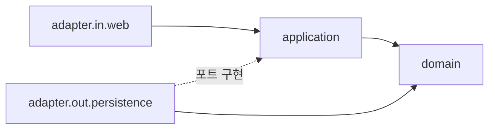
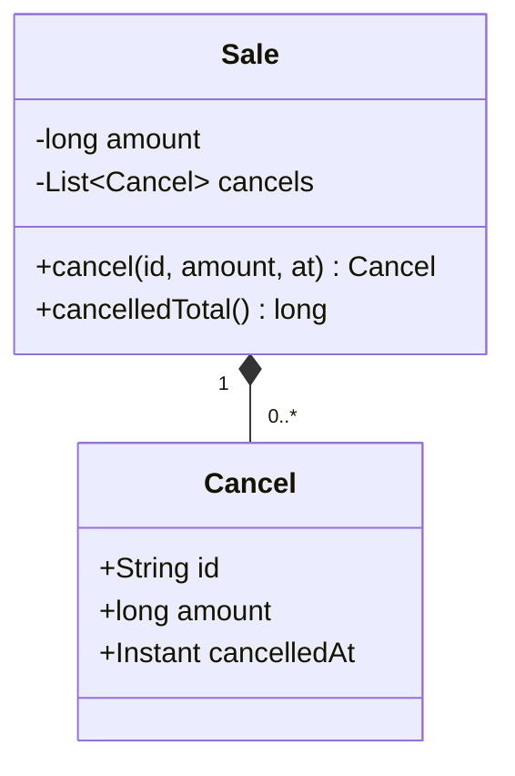
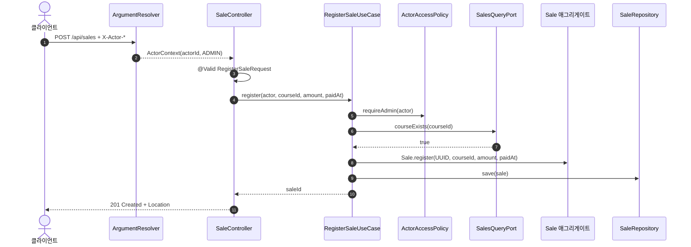
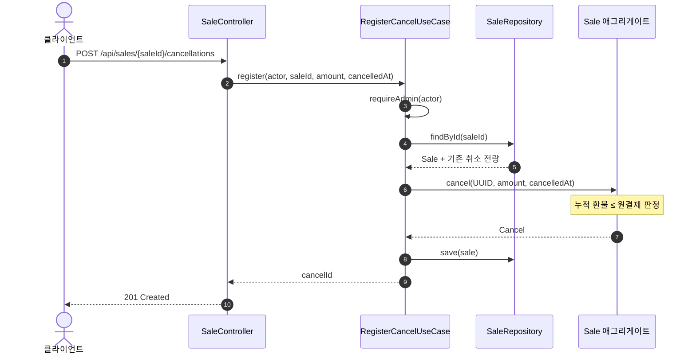
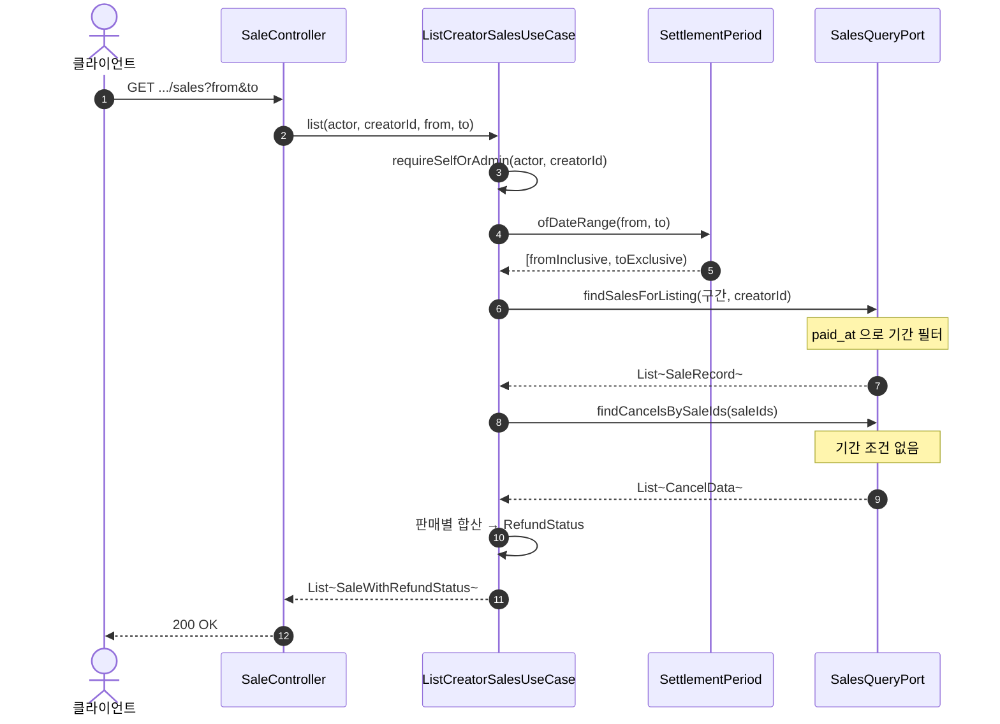
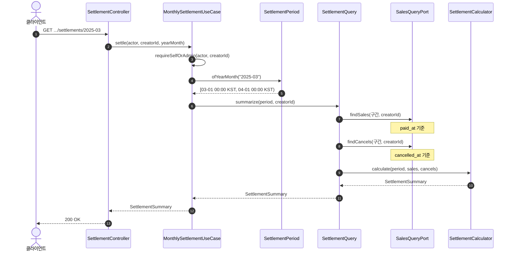
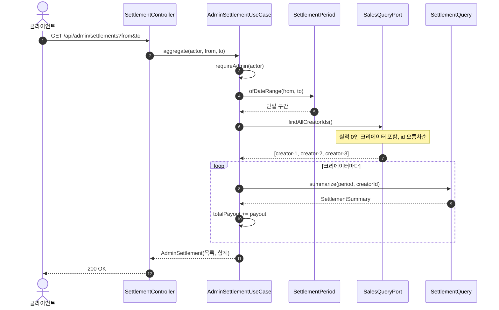

# 아키텍처와 요청 흐름

## 목차

1. [계층](#계층)
2. [의존 방향](#의존-방향)
3. [애그리게이트는 하나뿐입니다](#애그리게이트는-하나뿐입니다)
4. [읽기와 쓰기가 다른 모델을 씁니다](#읽기와-쓰기가-다른-모델을-씁니다)
5. [UC-1. 판매 등록](#uc-1-판매-등록)
6. [UC-2. 취소(환불) 등록](#uc-2-취소환불-등록)
7. [UC-3. 크리에이터 기간별 판매 목록](#uc-3-크리에이터-기간별-판매-목록)
8. [UC-4. 크리에이터 월별 정산](#uc-4-크리에이터-월별-정산)
9. [UC-5. 운영자 기간 정산 집계](#uc-5-운영자-기간-정산-집계)
10. [다섯 흐름을 관통하는 것](#다섯-흐름을-관통하는-것)

## 계층

헥사고날(포트와 어댑터)입니다. 최상위 축은 계층이고 그 아래 축은 계층마다 다릅니다.
`adapter.in` 아래는 전달 기술, `domain` 아래는 업무 영역입니다.

```
com.liveclass.settlement
├── adapter
│   ├── in/web            Controller · ArgumentResolver · GlobalExceptionHandler · dto
│   └── out/persistence   JPA Entity · Repository · Adapter
├── application
│   ├── access            ActorContext · ActorRole · ActorAccessPolicy
│   ├── port/out          SalesQueryPort · SaleRecord
│   ├── sales             등록 · 취소 · 목록 유스케이스
│   └── settlement        월별 · 운영자 정산 유스케이스
├── domain
│   ├── sales             Sale 애그리게이트 · Cancel · SaleRepository
│   └── settlement        SettlementCalculator · SettlementPeriod · FeePolicy
└── config                DomainConfig · WebMvcConfig
```

## 의존 방향



**화살표가 전부 안쪽을 향하고 `domain`에서 나가는 화살표가 없습니다.** 그게 이 그림이
하는 유일한 말이고, 파일 목록만 봐서는 보이지 않습니다.

`domain`에는 Spring·JPA·Lombok import가 0건입니다. 그래서 계산 규칙 테스트 44건이
컨텍스트 기동 없이 돕니다.

## 애그리게이트는 하나뿐입니다



`Sale`만 `cancel()`을 갖고 `Cancel`은 홀로 존재하지 않습니다. **누적 환불 ≤ 원결제**를
지켜야 하는 지점이 프로젝트에서 여기 하나라서, 애그리게이트도 여기 하나입니다.

정산 계산 쪽에는 두지 않았습니다. 거기는 불변식이 없고 전부 값에 대한 순수 함수입니다.
**애그리게이트는 지킬 불변식이 있을 때만 값어치가 있습니다.**

## 읽기와 쓰기가 다른 모델을 씁니다

| | 경로 | 모델 |
| --- | --- | --- |
| 쓰기 | `SaleRepository` → `Sale` 애그리게이트 | 불변식이 필요합니다 |
| 읽기 | `SalesQueryPort` → `SaleRecord` · `SaleData` | 평평한 값의 합산입니다 |

같은 테이블을 보지만 모델이 다릅니다. 목록 조회가 애그리게이트를 N개 적재하면 각각이
자기 취소를 딸고 와 N+1이 됩니다.

---

각 유즈케이스는 **성공 경로만** 그리고 실패 분기는 표로 뺐습니다. 분기를 다이어그램에
넣으면 그림이 커지고 정작 중요한 호출 순서가 묻힙니다.

모든 요청은 `ActorContextArgumentResolver`를 먼저 지납니다. `X-Actor-Id`와 `X-Actor-Role`
헤더를 `ActorContext`로 바꾸고, 없거나 형식이 어긋나면 그 자리에서 400으로 끊습니다.
UC-1에만 그리고 나머지는 생략합니다.

**접근 판정은 컨트롤러가 아니라 유스케이스가 합니다.** 컨트롤러에 두면 유스케이스를 직접
테스트할 때 경계가 빠지고, 엔드포인트가 늘 때마다 같은 호출을 복제하게 됩니다.


## UC-1. 판매 등록

`POST /api/sales` · ADMIN 전용



`courseExists` 검사가 필수입니다. FK 제약이 없어 없는 `courseId`로도 행이 들어가고,
그 판매는 `course → creator` 조인을 타는 정산 조회에서 영원히 보이지 않습니다.

식별자는 도메인이 아니라 유스케이스가 만듭니다. 도메인이 `UUID.randomUUID()`를
부르면 테스트가 결과를 단언할 수 없습니다.

| 실패 | 지점 | 응답 |
| --- | --- | --- |
| 헤더 누락·형식 오류 | ArgumentResolver | 400 `INVALID_ACTOR_HEADER` |
| 금액 0 이하, 필수 필드 누락 | Bean Validation | 400 `VALIDATION_FAILED` |
| 오프셋 없는 `paidAt` | Jackson 역직렬화 | 400 `MALFORMED_REQUEST` |
| CREATOR가 호출 | ActorAccessPolicy | 403 `ACTOR_ACCESS_DENIED` |
| 없는 강의 | SalesQueryPort | 404 `COURSE_NOT_FOUND` |

---

## UC-2. 취소(환불) 등록

`POST /api/sales/{saleId}/cancellations` · ADMIN 전용



**유스케이스에 금액 비교문이 없습니다.** 초과 환불 거부는 애그리게이트 안에 있습니다.

```java
if (amount > this.amount - already) throw new RefundAmountExceededException(...);
```

`already + amount > this.amount`로 쓰지 않은 것은 오버플로 때문입니다.
`Long.MAX_VALUE`가 들어오면 덧셈이 음수로 돌아 검사를 그냥 통과합니다. 뺄셈은 두
항 모두 음수가 아니라 넘치지 않습니다. `>=`가 아니라 `>`인 것도 의도입니다. 합계가
원결제와 정확히 같으면 전액 환불이므로 허용해야 합니다.

`findById`가 기존 취소를 **전량** 적재하는 것이 이 판정의 전제입니다. 부분 적재하면
누적 합계가 실제보다 작게 나와 초과 환불이 통과합니다.

동시성은 보장하지 않습니다. 요청 둘이 동시에 오면 각자 같은 잔여액을 읽고 각자
검사를 통과합니다. [가정 11](05-가정과-미구현-범위.md) 참조.

| 실패 | 지점 | 응답 |
| --- | --- | --- |
| 금액 0 이하 | Bean Validation | 400 `VALIDATION_FAILED` |
| CREATOR가 호출 | ActorAccessPolicy | 403 `ACTOR_ACCESS_DENIED` |
| 없는 판매 | SaleRepository | 404 `SALE_NOT_FOUND` |
| 누적 환불 초과 | Sale 애그리게이트 | 409 `REFUND_AMOUNT_EXCEEDED` |

---

## UC-3. 크리에이터 기간별 판매 목록

`GET /api/creators/{creatorId}/sales?from=&to=` · 본인 CREATOR 또는 ADMIN



**이 유즈케이스의 유일한 함정은 두 번째 조회에 기간 필터가 없다는 점입니다.**

시드의 `sale-5`가 그 이유입니다. 1월 31일 판매인데 취소는 2월 3일입니다. 1월 목록을
조회하면서 취소도 1월로 좁히면 환불 상태가 `FULL`이어야 할 것이 `NONE`으로
나옵니다. 금액 집계는 기간으로 나뉘고 환불 상태는 나뉘지 않습니다.

판매가 0건이면 어댑터가 쿼리 없이 빈 리스트를 돌려줍니다. 빈 컬렉션을 그대로
JPQL로 내리면 `in ()`이 되고 동작이 dialect마다 갈립니다.

| 실패 | 지점 | 응답 |
| --- | --- | --- |
| `from` 또는 `to` 누락 | Spring MVC | 400 `MISSING_PARAMETER` |
| 날짜 형식 오류, 종료일 < 시작일 | SettlementPeriod | 400 `INVALID_SETTLEMENT_PERIOD` |
| CREATOR가 타인 조회 | ActorAccessPolicy | 403 `ACTOR_ACCESS_DENIED` |

없는 크리에이터는 404가 아니라 200 + 빈 배열입니다.

---

## UC-4. 크리에이터 월별 정산

`GET /api/creators/{creatorId}/settlements/{yearMonth}` · 본인 CREATOR 또는 ADMIN



**유스케이스에 산술이 한 줄도 없습니다.** 계산은 순수 함수인 계산기가 소유합니다.

```text
netSales = grossSales - refunds
fee      = netSales <= 0 ? 0 : netSales * 2000 / 10000
payout   = netSales - fee
```

음수 판정이 나눗셈보다 먼저인 것이 정책 자체입니다. `long` 나눗셈은 0 방향 절단이라
순서가 바뀌면 −60,000에서 −12,000이 나와 플랫폼이 크리에이터에게 수수료를
돌려주는 셈이 됩니다.

판매도 취소도 없는 달은 404가 아니라 전 항목 0원 정상 응답입니다. 404로 두면
"정산이 없다"와 "크리에이터가 없다"를 클라이언트가 구분할 수 없습니다.

| 실패 | 지점 | 응답 |
| --- | --- | --- |
| `2025-13` 같은 잘못된 연월 | SettlementPeriod | 400 `INVALID_SETTLEMENT_PERIOD` |
| CREATOR가 타인 조회 | ActorAccessPolicy | 403 `ACTOR_ACCESS_DENIED` |

연월을 `String`으로 받는 이유가 이 표에 있습니다. `@PathVariable YearMonth`로
바인딩하면 Spring이 `MethodArgumentTypeMismatchException`을 먼저 던져 거부가
도메인이 아니라 프레임워크에서 일어나고 오류 코드가 달라집니다.

---

## UC-5. 운영자 기간 정산 집계

`GET /api/admin/settlements?from=&to=` · ADMIN 전용



**기간 전체를 단일 구간으로 계산합니다. 월별로 계산해 더하지 않습니다.**

이 시스템에서 가장 설명하기 어려운 동작입니다. `creator-2`의 2025-01~03이 두
방식을 갈라놓습니다.

| 방식 | 계산 | 결과 |
| --- | --- | ---: |
| 단일 구간 | 판매 120,000 − 환불 60,000 = 60,000, 수수료 12,000 | 48,000 |
| 월별 합산 | 1월 48,000 + 2월 (−60,000) + 3월 48,000 | 36,000 |

차이 12,000원은 월별 합산일 때 2월의 음수 순매출에 수수료 0원 제한이 걸려 1월에
이미 뗀 수수료가 상쇄되지 않기 때문입니다. 전체 합계로는 **264,000 대 252,000**입니다.

월별 합산을 쓰지 않는 이유는 음수 월마다 수수료 0원 제한이 반복 적용돼 크리에이터에게
불리하고, "왜 월별 합과 다른가"를 설명할 수 없기 때문입니다.

`findAllCreatorIds()`가 따로 필요한 이유는 `creator-3`입니다. 3월에 판매도 취소도
없어서 판매·취소 자료만 훑으면 존재 자체를 알 수 없고 목록에서 통째로 빠집니다.

크리에이터마다 포트를 두 번 부릅니다(N+1). 3명이라 실측 차이가 0이고, 포트 계약을
"`creatorId` 항상 필수"로 단순하게 유지하기 위한 선택입니다. 수천 명이면 다시 볼
지점입니다.

| 실패 | 지점 | 응답 |
| --- | --- | --- |
| `from` 또는 `to` 누락 | Spring MVC | 400 `MISSING_PARAMETER` |
| 날짜 형식 오류, 종료일 < 시작일 | SettlementPeriod | 400 `INVALID_SETTLEMENT_PERIOD` |
| CREATOR가 호출 | ActorAccessPolicy | 403 `ACTOR_ACCESS_DENIED` |

---

## 다섯 흐름을 관통하는 것

**접근 경계.** 해석기는 필터가 아니라 파라미터 타입 기반 opt-in입니다. `ActorContext`를
선언하지 않은 컨트롤러 메서드는 헤더 검사도 인가 판정도 없이 조용히 열립니다.
컴파일러가 못 잡으므로 `ControllerActorGuardTest`가 리플렉션으로 검사합니다.
`/api/admin/settlements`가 전체 매출이 나가는 유일한 엔드포인트라 특히 그렇습니다.

**시간.** KST 반열린 구간 `[시작 00:00, 종료 다음날 00:00)`입니다. 원본 과제의
"말일 23:59:59"는 초 미만이 누락돼 의도적으로 이탈했습니다. 시간대 지식은
`SettlementPeriod` 한 클래스에만 삽니다. 나머지는 전부 `Instant`입니다.

**오류.** `GlobalExceptionHandler`가 전부 RFC 9457 Problem Details로 바꿉니다.
`Exception` catch-all을 두지 않아 `NullPointerException` 같은 자체 버그가 400으로
위장되지 않습니다.

---

관련 문서 — [API와 오류](00-API-와-오류.md) · [데이터 모델과 영속성](02-데이터-모델과-영속성.md)
