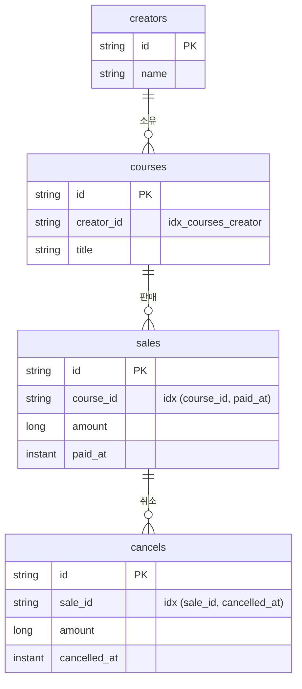

# Task 7.3 — 데이터 모델·ERD·초기 데이터 표 명세

부모: [`task-7-readme-submission-spec.md`](./task-7-readme-submission-spec.md) · 의존 Task 2 · 15분

**원본은 [`docs/02-데이터-모델과-영속성.md`](../../02-데이터-모델과-영속성.md)다.** 영속성 설계 결정 10건과 근거, 예상 질문과 답이 정리돼 있다. 이 절은 거기서 데이터 모델과 직접 관련된 것만 추린다.

## ERD

GitHub가 Mermaid를 렌더링하므로 README에서 그림으로 보인다. 코드블록으로 두면
평가자가 읽어야 할 것이 하나 늘어난다.

**판매는 크리에이터를 직접 갖지 않는다.** 강의를 거쳐 안다. 크리에이터로 좁히는 조회는 전부 조인이다. 비정규화하면 조인이 사라지지만 강의 소유자가 바뀔 때 판매 행 전부를 같이 고쳐야 하고, 안 고치면 과거 정산이 조용히 틀어진다. 7건 규모에서 조인 비용이 0이라 정규화를 택했다.

**환불 상태 컬럼이 없다.** 취소 합계에서 매번 계산한다. 저장하면 취소가 하나 더 들어올 때 갱신을 빠뜨리는 경로가 생긴다.

**FK 제약을 걸지 않았다.** 없는 강의로 판매를 등록하는 것은 애플리케이션이 `CourseNotFoundException` 404로 막는다. DB 제약에 맡기면 `DataIntegrityViolationException`이 500으로 새어 나간다.

## 조회 경로

어느 조회가 어느 테이블을 거쳐 어느 시간 컬럼으로 좁히는지 표로 싣는다. JPQL을
열지 않고도 쿼리 설계가 보여야 한다.

| 조회 | 경로 | 기간 필터 컬럼 |
| --- | --- | --- |
| 기간 내 판매 (정산·목록) | `sales → courses` | `paid_at` |
| 기간 내 취소 (정산) | `cancels → sales → courses` | `cancelled_at` |
| 판매별 전체 취소 (환불 상태·애그리게이트 적재) | `cancels` | **없음** |
| 크리에이터 전체 (실적 0 포함) | `creators` | 없음 |
| 강의 존재 확인 (등록 검증) | `courses` | 없음 |

**세 번째 행의 "없음"이 핵심이다.** 환불 상태는 기간의 속성이 아니라 판매의
속성이라 시간 조건을 걸지 않는다. 여기에 조건을 넣으면 `sale-5`를 1월로 조회할 때
`FULL`이 아니라 `NONE`이 나온다. 규칙이 스키마 접근 방식에 그대로 드러난다.

위 두 행은 기준 컬럼이 서로 다르다. 이중 집계 기준(7.4)이 쿼리 층에서 어떻게
생겼는지 보여주는 자리다.

## 초기 데이터 표

시드는 크리에이터 3 + 강의 4 + 판매 7 + 취소 3 = **17행**이다.

| 판매 | 강의 | 크리에이터 | 금액 | 결제 (KST) |
| --- | --- | --- | ---: | --- |
| sale-1 | course-1 | creator-1 | 50,000 | 2025-03-05 10:00 |
| sale-2 | course-1 | creator-1 | 50,000 | 2025-03-15 14:30 |
| sale-3 | course-2 | creator-1 | 80,000 | 2025-03-20 09:00 |
| sale-4 | course-2 | creator-1 | 80,000 | 2025-03-22 11:00 |
| sale-5 | course-3 | creator-2 | 60,000 | **2025-01-31 23:30** |
| sale-6 | course-3 | creator-2 | 60,000 | 2025-03-10 16:00 |
| sale-7 | course-4 | creator-3 | 120,000 | 2025-02-14 10:00 |

| 취소 | 원본 | 금액 | 취소 (KST) | 구분 |
| --- | --- | ---: | --- | --- |
| cancel-1 | sale-3 | 80,000 | 2025-03-25 10:00 | 전액 |
| cancel-2 | sale-4 | 30,000 | 2025-03-26 10:00 | 부분 |
| cancel-3 | sale-5 | 60,000 | **2025-02-03 10:00** | 전액, 월 경계 |

굵게 표시한 두 행이 월 경계 시나리오다. `sale-5`는 KST 1월 마지막 날 23:30 결제(UTC로는 `2025-01-31T14:30Z`)이고 취소는 2월이다. **판매는 1월, 환불은 2월에 귀속된다.**

## 기대 정산 표

| 크리에이터 | 월 | 총 판매(건) | 환불(건) | 순 판매 | 수수료 | 정산 예정 |
| --- | --- | --- | --- | ---: | ---: | ---: |
| creator-1 | 2025-03 | 260,000 (4) | 110,000 (2) | 150,000 | 30,000 | 120,000 |
| creator-2 | 2025-01 | 60,000 (1) | 0 (0) | 60,000 | 12,000 | 48,000 |
| creator-2 | 2025-02 | 0 (0) | 60,000 (1) | −60,000 | **0** | **−60,000** |
| creator-2 | 2025-03 | 60,000 (1) | 0 (0) | 60,000 | 12,000 | 48,000 |
| creator-3 | 2025-02 | 120,000 (1) | 0 (0) | 120,000 | 24,000 | 96,000 |
| creator-3 | 2025-03 | 0 (0) | 0 (0) | 0 | 0 | 0 |

creator-2의 2025-02가 이 표에서 가장 설명이 필요한 행이다. 판매 없이 1월 판매분의 취소만 있어 순 판매액이 음수다. **수수료는 0으로 막고 정산 예정액은 음수를 그대로 둔다.** 근거는 7.5 가정 5.

creator-3의 2025-03은 빈 월이다. 404가 아니라 전 항목 0으로 응답한다.

## 취소 데이터를 직접 정의했다

원본 과제에 취소 초기 데이터가 없다. 금액과 귀속 월은 과제 서술("3월 취소", "2월 초 취소")에서 가져오고, **구체 시각은 10:00 KST로 고정했다.** 자정과 자정 직전에서 멀어 어떤 구간 구현에서도 귀속 월이 흔들리지 않는다. 경계 검증은 단위 테스트 픽스처가 따로 세 방향으로 잠갔다.

## 식별자를 `String`으로 뒀다

`CreatorId` / `SaleId` 타입 래퍼를 만들면 타입 안전성은 오르지만 클래스와 변환 코드가 늘어난다. 원본 데이터의 식별자가 `creator-1` 같은 문자열이라 래핑 이득도 작다.

**시드의 `sale-1` 형태는 형식 제약이 아니다.** `POST /api/sales`가 만드는 판매는 서버 생성 UUID다. 응답 예시에 두 형태가 같이 보이므로 한 줄 설명을 붙인다.

## 인덱스 순서 관찰

`(course_id, paid_at)`, `(sale_id, cancelled_at)`을 유지했다. 뒤집자는 검토가 있었으나 **두 조회 경로가 상반된 선행 컬럼을 원한다.**

특히 `findCancelsBySaleIds`는 시간 조건이 아예 없어 `sale_id` 선행이 필요하다. `(cancelled_at, sale_id)`로 두면 풀스캔이 된다. 반대로 기간별 취소 조회는 `cancelled_at` 선행이 유리하다.

7건 규모에서 실측 차이가 0이라 하나만 두고 관찰을 남긴다. **실제 트래픽이면 인덱스를 하나 더 두거나 커버링 인덱스를 검토할 지점이다.**

## 완료 기준

1. ERD가 Mermaid로 있고 판매→크리에이터 경로가 드러난다.
1-b. 조회 경로 표가 있고 환불 상태 조회에 기간 필터가 없음이 강조돼 있다.
2. 시드 17행이 표로 있다. 월 경계 두 행이 강조돼 있다.
3. 기대 정산 6행이 표로 있다.
4. 취소 데이터를 직접 정의한 근거가 있다.
5. 인덱스 순서 관찰이 있다.
